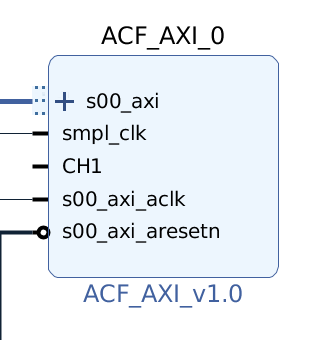
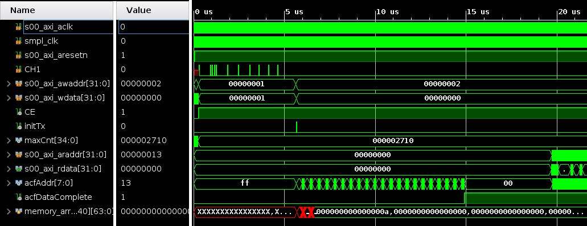

# ACF-AXI
A hardware implementation of an autocorrelation function that conforms to the AXI protocol

## IP

## Current State
This `ACF_AXI` IP is capable of being configured as well as read by its AXI master.

## Testing

